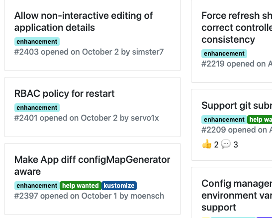

# Github Toolkit

Install:

```
GO111MODULE=on go install github.com/alexec/github-toolkit/cmd/ght
```

Create release note:

```
cd my-repo
ght relnote v1.3.0-rc3..v1.3.0-rc4
```

Create cards:

```
cd my-repo
ght cards --help
```




# Building

```
make
```